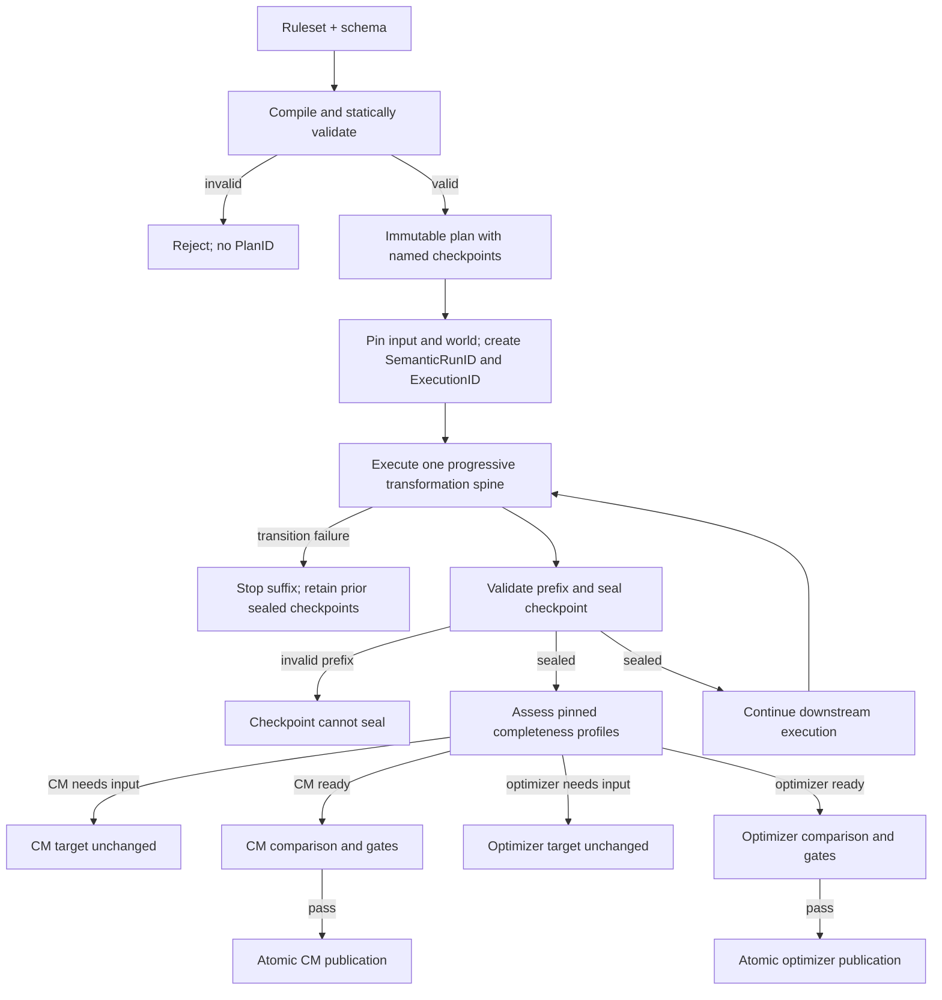
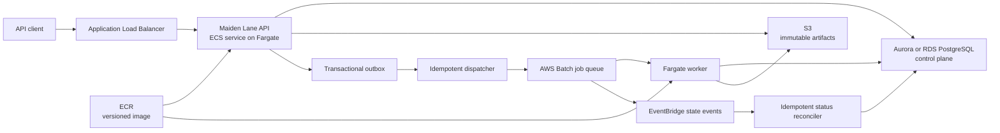

# Maiden Lane High-Level Design

**Status:** Approved design for the current documentation phase

**Date:** 2026-08-11

**Audience:** Data engineering, platform engineering, application engineering, and technical leadership

**Highest repository authority:** [Ratified Maiden Lane Inviolates](../../../Inviolates.md)

**Progressive-completeness amendment:** [Consumer-scoped checkpoints and publication](2026-08-12-progressive-completeness-design.md)

## 1. Executive summary

Maiden Lane is a Go service for compiling, executing, explaining, and gating data transformations. Its purpose is to make an entire class of customer-discovered mapper defects impossible to deploy.

The current mapper treats SQL and dbt models as both the execution representation and the source of business meaning. Maiden Lane separates those concerns. Customer semantics are expressed as closed, typed transformation rules and compiled into an immutable, backend-independent semantic plan. The plan can initially execute in Go and may later compile into SQL or dbt without changing the meaning of the rules.

A transformation does not directly mutate published state. It proposes an attributable structural patch, validates the patch and resulting candidate state, and records a semantic journal. Named checkpoints seal valid immutable states along one progressive transformation spine. Separately compiled completeness profiles determine whether a checkpoint is ready for a particular consumer; CM and the optimizer may therefore use different checkpoints without acquiring separate transformation semantics. A checkpoint becomes publishable to a target only after its protected invariants, consumer readiness, provenance, and regression policy pass. Publication is an atomic pointer update to an immutable artifact.

Maiden Lane is a separate Go module. It may reuse stable infrastructure primitives from stochflow, but only through Maiden Lane-owned ports and adapters. Stochflow's agent contracts, economic statechart, and agent-specific journal do not define Maiden Lane's domain.

## 2. Problem statement

SQL remains an effective execution technology for set-oriented warehouse transformations. The problem is that mapper semantics have leaked into SQL, Jinja, generated SQL, Python UDFs, and per-customer YAML. This produces several systemic failure modes:

- Business concepts such as team state, delivery state, and entity scope lack one typed definition.
- Invalid aggregate states can be represented and published successfully.
- Customer-specific rules can hide their dependencies inside arbitrary SQL.
- Mutable reference data and catalogs make historical execution difficult to reproduce.
- Fused SQL obscures which semantic rule changed an entity and why.
- Most failures are discovered by inspecting final relations, sometimes after a customer sees them.
- One global notion of completeness couples sparse consumers such as Commitment Manager to the optimizer's much broader information requirements.
- Separate consumer pipelines would duplicate interpretation decisions, lose shared state history, and permit the pipelines to drift.

The target is not to eliminate SQL. It is to make SQL one possible backend for semantics defined elsewhere.

## 3. Goals

Maiden Lane will establish the following properties:

1. Transformation semantics belong to Maiden Lane, not to an execution backend.
2. Rules compile into an immutable, inspectable, content-addressed semantic plan.
3. Structural operations cover inserts, deletes, updates, merges, splits, and relation changes.
4. Static plan validation and dynamic state validation are separate, fail-closed phases.
5. Journals describe semantic changes rather than backend mechanics.
6. Everything that can affect replay is pinned and content-addressed.
7. A failed protected invariant cannot produce a publishable artifact.
8. Baseline and candidate plans can execute against the same historical world and be compared before publication.
9. Execution backends must prove semantic equivalence to the reference Go executor.
10. One canonical transformation spine can seal multiple immutable checkpoints without forking consumer semantics.
11. Completeness is a closed, typed, consumer-relative assessment over a checkpoint, not a universal property of state.
12. Consumer-scoped publication targets can advance independently while preserving one attributable record lineage.

## 4. Non-goals for this design phase

This design does not commit to:

- A production implementation milestone or first customer rollout.
- A final JSON or YAML surface syntax for the rule language.
- A final external syntax for completeness profiles or checkpoint declarations.
- A SQL or dbt backend.
- Parallel transformer execution.
- Arbitrary SQL in the certified transformation language.
- Visual rule authoring or automated rule repair.
- Multi-region active-active operation.
- A general-purpose workflow engine.

These are outside the current design exercise, not promises on a roadmap.

## 5. Architectural decisions

### 5.1 Separate application with a narrow stochflow boundary

Three approaches were considered:

| Approach | Decision |
|---|---|
| Separate application with selective stochflow reuse | Chosen. It preserves Maiden Lane's domain while reusing suitable infrastructure. |
| Compile transformations directly into the current stochflow statechart | Rejected. Its contracts, execution vocabulary, economic state, and journal are agent-specific. |
| Implement every primitive independently | Rejected for now. It would duplicate stable byte-level hashing and comparison work. |

Maiden Lane defines its own ports:

```go
type ContentHasher interface {
	HashCanonical(data []byte) Digest
}

type CandidateComparator interface {
	Compare(ctx context.Context, baseline, candidate ExecutionRef) (Comparison, error)
}
```

Only `internal/adapters/stochflow` may import stochflow. Maiden Lane owns its canonical byte formats in `internal/canonical`; hashing adapters receive only bytes that Maiden Lane has already canonicalized. Initial stochflow reuse may include its byte-level digest helper from `journal` and the generic paired comparison behavior in `compare`. The adapter can be replaced without changing any semantic package or reinterpreting a Maiden Lane value.

Canonicalization and hashing are separate contracts: Maiden Lane decides what
the bytes mean, while `ContentHasher` applies the configured digest algorithm
to those bytes. A canonical format or digest algorithm change requires an
explicit version migration rather than an invisible adapter change.

The dependency is pinned to a tag or exact pseudo-version. A local `replace github.com/optimaldynamics/stochflow => ../stochflow` directive is acceptable for workstation development but is not a deployment strategy.

### 5.2 One source of semantic meaning

Rules never compile independently into separate Go and SQL interpretations:

```text
rules + schema + compiler version
                │
                ▼
       canonical semantic plan
          ┌─────┴─────┐
          ▼           ▼
     Go executor   SQL compiler
```

The Go executor is the reference implementation. A future SQL compiler consumes the canonical semantic plan, not the original rule document.

### 5.3 Logical immutability

States, plans, rule sets, worlds, journals, and outputs are immutable semantic values. An implementation may use copy-on-write structures, chunked files, or database transactions, provided the externally visible semantics remain immutable and content-addressed.

## 6. Identity model

Identity is layered so semantic intent is independent of physical execution:

\[
InputID = H(S_0, C)
\]

\[
PlanID = H(P)
\]

\[
SemanticRunID = H(InputID, PlanID)
\]

\[
ExecutionID = H(SemanticRunID, ExecutorIdentity, ProvenancePolicy)
\]

For completeness assessment:

\[
ProfileID = H(CanonicalProfile)
\]

\[
CheckpointArtifactID = H(
SemanticRunID,
CheckpointID,
StateDigest,
JournalPrefixDigest,
InvariantResultDigest,
ProvenancePolicy)
\]

\[
AssessmentID = H(CheckpointArtifactID, ProfileID)
\]

Where:

- `S0` is the canonical input state.
- `C` is the pinned execution world.
- `P` is the canonical semantic plan.
- `SemanticRunID` identifies the requested computation independently of how it is executed.
- `ExecutorIdentity` includes the backend and its version, such as `go@<digest>` or `sql-snowflake@<digest>`.
- `ProvenancePolicy` affects required execution artifacts but not the requested computation.
- `ProfileID` identifies a compiled, immutable consumer-completeness contract.
- `CheckpointArtifactID` identifies a realized checkpoint's state, journal prefix, applicable invariant results, and provenance policy without incorporating executor identity.
- `AssessmentID` identifies the deterministic readiness verdict for one checkpoint and profile.

An operational retry has a separate `AttemptID`. Attempts may change timing and infrastructure placement but cannot change the semantic inputs or executor identity of an execution.

Repeating the same `ExecutionID` must return existing artifacts or reproduce byte-identical artifacts. Any divergence is a hard integrity failure. Two certified executors for one `SemanticRunID` must produce identical checkpoint and final-state, semantic-journal, and invariant-result digests at the required provenance level. Operational metadata such as timestamps, Batch job IDs, and attempt counts is excluded from those semantic artifacts.

Changing a completeness profile changes `ProfileID` and `AssessmentID`; it does
not change `PlanID`, `SemanticRunID`, or a historical checkpoint artifact.
Profiles assess semantic results but do not reinterpret the requested
transformation.

Publication points to a sealed immutable checkpoint artifact produced by a
certified `ExecutionID`, while retaining `SemanticRunID`, `ExecutionID`,
`ProfileID`, and `AssessmentID` in its audit record. This permits backend
certification to state, without collapsing the executions into one identity:

```text
SemanticRunID X

Go ExecutionID  → checkpoint C: state digest A, journal-prefix digest B
SQL ExecutionID → checkpoint C: state digest A, journal-prefix digest B
```

## 7. Semantic state and pinned world

### 7.1 State

State is a typed entity graph:

```text
State
├── schema digest
├── entities
│   └── EntityRef(kind, source ID) → typed Entity
├── relations
│   └── Relation(kind, from, to)
└── state digest
```

Entity identities are stable within an input lineage. Relations are explicit values rather than incidental foreign-key joins. Field values carry schema-defined types; semantic code does not depend on untyped maps.

#### 7.1.1 Source and synthetic entity identity

Source entity IDs are deterministically namespaced from the input lineage,
entity kind, and canonical source key. Every operator that creates an entity
must also provide a typed, deterministic output-key expression in the semantic
plan. The expression may read only declared fields and pinned world values.

The reference construction for a synthetic identity is:

\[
EntityID = H_c(
  "maiden-lane.synthetic-entity.v1",
  InputLineageID,
  EntityKind,
  RuleID,
  CanonicalProgenitors,
  SemanticOutputKey
)
\]

`Hc` means hashing Maiden Lane's canonical encoding of the tuple.
`CanonicalProgenitors` is a canonical sequence of input identities. For an
unordered operation it is sorted by `EntityID`; when roles are semantically
meaningful it is a sequence of `(role, EntityID)` sorted by role and then ID.
`SemanticOutputKey` distinguishes multiple outputs of the same kind, including
the outputs of a split.

The compiler rejects a creating operator without a valid output-key expression.
The executor rejects an identity collision. Wall-clock values, random UUIDs,
backend row order, attempt identity, and execution identity are forbidden from
entity-ID construction. Consequently, certified backends create the same
entity IDs for the same `SemanticRunID`.

### 7.2 World

The execution world contains every external value a rule may observe, referenced by immutable digest or version:

```text
World
├── customer input snapshot
├── location reference snapshot
├── timezone catalog snapshot
├── rate or mileage reference snapshot
├── schema version
└── policy/configuration snapshots
```

Semantic execution performs no unjournaled external reads. A transform that needs reference data reads it from the pinned world supplied to the execution.

### 7.3 Record lineage and new evidence

Record lineage and semantic-run lineage are related but distinct. A sealed
checkpoint may become the parent of a new semantic run when a person or system
provides additional evidence. The descendant records the parent checkpoint and
new evidence digest, but receives a new pinned input or world, `InputID`, and
`SemanticRunID`.

```text
SemanticRun A
  C0 -> C1 -> C2 (sealed)
                   |
                   | new evidence E
                   v
SemanticRun B
  parent checkpoint: A:C2
  evidence digest:   H(E)
  C0' -> C1' -> ...
```

This preserves one attributable record genealogy without pretending that new
information existed in the original execution. Earlier checkpoints remain
immutable descriptions of what was lawfully knowable from their pinned
evidence. The system can mature its stored state without requiring the
customer to re-upload the original record.

## 8. Closed rule language

A rule is a typed declaration containing:

- Stable rule identity and version.
- A closed predicate expression.
- Typed transformation operator and operands.
- Fields and relations read.
- Fields and relations written.
- Explicit ordering requirements where data dependencies alone are ambiguous.
- Preconditions and postconditions.
- Evidence requirements.

The initial grammar is limited to statically analyzable constructs such as typed comparisons, Boolean composition, null and existence checks, deterministic lookups, bounded arithmetic, aggregates, and the structural operations defined below.

The compiler derives read and write sets from the expression tree and operator. If the authored declarations disagree with the derived sets, compilation fails. Data-dependent field names and dynamic code evaluation are prohibited in the certified language.

Arbitrary SQL is not supported by the current design. If an `opaque_sql` migration mechanism is introduced later, it must be visibly unsafe, carry degraded guarantees, prohibit fusion, and remain non-publishable through the normal certified path.

### 8.1 Completeness profiles

A completeness profile is a closed, typed declaration of the information a
consumer requires. It may contain field-presence, value-validity, relation,
cardinality, and other statically analyzable semantic predicates. Profiles
compile deterministically against a schema into immutable content-addressed
contracts.

Profiles assess checkpoints. They do not transform state, add dependencies to
the transformation graph, waive protected invariants, or select an alternate
plan. A readiness assessment produces `ready` or `needs_input` plus stable
requirement codes and safe evidence references.

Each profile declares the entity and relation scope it assesses and how
individual results aggregate into the target verdict. Assessment cannot
silently omit an entity that fails the profile. An intentionally consumed
subset requires an explicit typed output contract with attributable provenance;
it is not an assessment side effect.

Profiles may declare a partial order. For example,

\[
P_{CM} \preceq P_{Optimizer}
\]

means the profile compiler can prove:

\[
Ready(S, P_{Optimizer}) \Rightarrow Ready(S, P_{CM})
\]

The ordering is an implication contract, not a scalar completeness score. Not
all future consumer profiles must be comparable, and profile ordering does not
assert that every transformation monotonically adds information.

## 9. Immutable semantic plan

Compilation is deterministic:

\[
P = Compile(Rules, Schema, CompilerVersion)
\]

A plan contains:

```text
Plan
├── format version
├── compiler version
├── schema digest
├── ruleset digest
├── canonical ordered transformations
├── derived read/write sets
├── dependency edges and stable execution levels
├── named checkpoint declarations and prefix boundaries
├── preconditions and postconditions
├── checkpoint and execution-level invariants
├── backend requirements
└── plan digest
```

The plan is serializable, inspectable, backend-independent, immutable, and content-addressed. Canonical ordering is part of the format contract.

### 9.1 Static validation

Compilation rejects:

- Unknown entities, relations, fields, rules, or operators.
- Type-incompatible comparisons, assignments, or aggregates.
- Undeclared or mismatched reads and writes.
- Missing dependencies.
- Dependency cycles.
- Write/write conflicts without explicit ordering.
- Invalid rule composition.
- Duplicate, unreachable, or ambiguous checkpoint declarations.
- Checkpoint boundaries that split an atomic transformation.
- Operators that cannot satisfy the requested provenance policy.

A failed compilation does not produce a `PlanID`.

## 10. Transformation and patch model

The core transition is:

\[
(S_{n+1}, \Delta_n) = T_n(S_n, C)
\]

A transformer never mutates shared state. It reads an immutable state and pinned world, then proposes a structural patch.

```go
type Transformer interface {
	Describe() TransformSpec
	Propose(ctx context.Context, state State, world World) (Patch, error)
}

type TransformSpec struct {
	ID             RuleID
	Reads          []FieldPath
	Writes         []FieldPath
	Preconditions  []Invariant
	Postconditions []Invariant
}
```

The closed structural operation set begins with:

- `Insert(entity)`
- `Delete(entity, beforeImage)`
- `Update(entity, beforeFields, afterFields)`
- `Merge(inputs, beforeImages, output)`
- `Split(input, beforeImage, outputs)`
- `Relate(from, relation, to)`
- `Unrelate(from, relation, to)`

Before-images may be embedded or referenced by digest. Physical storage may compress and deduplicate them without changing their semantic meaning.

Execution of one transformation is atomic:

```text
read immutable state
        │
        ▼
evaluate preconditions
        │
        ▼
propose structural patch
        │
        ▼
validate operation legality
        │
        ▼
apply to isolated candidate
        │
        ▼
validate postconditions
        │
        ▼
commit next state + semantic journal entry
```

If a check fails, the transition does not commit. A separate immutable failure report captures the rejected proposal, safe entity references, invariant results, and evidence digests. Accepted semantic journals contain only committed transitions.

Rollback of a published result normally restores an earlier immutable publication pointer. Inverse patch application exists for replay, diagnosis, and branch construction; it is not the primary production rollback mechanism.

### 10.1 Checkpoint sealing

A plan checkpoint is a named boundary after a complete transformation prefix.
When execution reaches that boundary, the executor may seal a checkpoint
artifact containing:

- the declared checkpoint identity;
- the canonical state digest;
- the complete journal-prefix digest at the requested provenance policy;
- applicable protected-invariant results;
- internal consistency links among those artifacts;
- immutable references to every semantic input required for exact replay.

A checkpoint seals only when every protected invariant applicable to its
prefix passes and its replay inputs are pinned. Sealing establishes a valid
semantic artifact; it does not establish consumer readiness or publication
eligibility. Replaying a sealed checkpoint must reproduce its canonical
representation; divergence is an integrity defect.

A downstream failure does not invalidate an earlier sealed checkpoint. A later
discovery that the checkpoint itself had an integrity defect is recorded as an
append-only quarantine decision. Quarantine blocks new certified publication
without rewriting or deleting the immutable checkpoint.

## 11. Dependency planning and execution

The compiler builds dependency edges from semantic access:

- A write followed by a read establishes ordering.
- A write/write conflict requires an explicit ordering edge or fails compilation.
- Cycles fail compilation.
- Independent transforms form stable execution levels.

The reference executor initially processes rules sequentially in stable lexical order within each level. This makes determinism easy to establish. A future executor may run independent transforms concurrently if it produces the same checkpoint state, journal-prefix, invariant, and final-result digests as reference execution. This amendment does not introduce partial-run or early-stop execution contracts; such an optimization would first require an explicit identity and artifact-obligation design.

## 12. Dynamic invariants

A valid plan does not imply a valid execution. Dynamic validation operates at three scopes:

### Operation invariants

- Referenced inputs exist in the predecessor state.
- Before-images match the predecessor state.
- New identities do not collide.
- Relation endpoints exist.
- Structural cardinality is valid.

### Rule invariants

- A team merge uses a coherent aggregation anchor.
- Driving time does not exceed elapsed time.
- A split or merge produces the required number and type of entities.
- Derived values satisfy customer-specific semantic constraints.

### Execution invariants

- Referential integrity holds across the complete candidate graph.
- Fanout and cardinality remain within declared bounds.
- Every protected customer and engine invariant passes.

Required entities and fields belong to a completeness profile when they are
required only by a particular consumer. They remain protected invariants only
when no lawful Maiden Lane state may omit them. A state can therefore be valid
while a profile assessment returns `needs_input`.

Execution and checkpoint invariants declare the prefixes to which they apply.
A checkpoint cannot seal until every protected invariant applicable to that
prefix passes. Protected invariants are unwaivable in the normal publication
path. Soft quality policies may permit a separately authorized and journaled
approval, but cannot turn invalid state into valid state or failed readiness
into a passing assessment.

## 13. Semantic provenance

Provenance is a requested execution policy:

| Mode | Records | Use |
|---|---|---|
| `summary` | Rules fired, affected entity references, counts, and state digests | High-volume observation; insufficient for publication |
| `changes` | Structural operations, before/after values or image references, evidence digests, checkpoint manifests, and invariant results | Minimum publishable mode |
| `full` | `changes` plus every intermediate state manifest and evaluation detail | Shadow executions, UAT, incidents, and backend certification |

The journal describes what occurred semantically:

```text
Merge(driver:A, driver:B → team:AB)
```

It does not describe backend mechanics such as a SQL statement number or warehouse row range.

Fusion is allowed only when the backend can still emit the required semantic provenance. A backend that produces the final relation but cannot produce the required journal is not certified for that execution policy.

Readiness assessment does not mutate state or append an accepted transition to
the semantic journal. It produces a separate immutable assessment artifact
over a sealed checkpoint and pinned profile.

## 14. Semantic-run, execution, and promotion lifecycle



Execution, gate, and publication state are independent:

```go
type ExecutionStatus string  // pending, running, succeeded, failed
type GateVerdict string      // not_evaluated, pass, fail
type ReadinessVerdict string // not_evaluated, ready, needs_input
type PublicationStatus string // unpublished, published, superseded
```

Execution, checkpoint sealing, readiness, promotion, and publication are
independent facts. A successfully executed pipeline can remain non-publishable.
A sealed checkpoint can be publishable to CM while remaining `needs_input` for
the optimizer. A sealed checkpoint can also remain eligible after a downstream
transition fails.

### 14.1 Promotion requirements

Promotion is evaluated for a target, sealed checkpoint, and pinned completeness
profile:

\[
Promotable(Target, C_k, P) =
Sealed(C_k)
\land Ready(C_k, P)
\land GatesPass(Target, C_k, P)
\]

The gate requires:

- Successful static plan validation.
- A sealed selected checkpoint with at least `changes` provenance.
- All protected dynamic invariants applicable to that checkpoint prefix passed.
- A `ready` assessment under the target's pinned `ProfileID`.
- Pinned input, world, schema, ruleset, compiler, semantic-run, execution, checkpoint, profile, and assessment identities.
- Baseline and candidate checkpoint executions over the same replay corpus, corresponding checkpoint semantics, and completeness profile.
- No protected metric regression.
- Internally consistent checkpoint state, journal-prefix, assessment, and invariant-result digests.
- A backend certified against the reference executor.

The complete execution may still be running or may later fail after the
selected checkpoint. Only the selected prefix must have sealed successfully.
Failure to meet one profile cannot block a different target whose profile
passes. This does not create a partial-run execution contract.

Publication is a compare-and-swap update of a versioned pointer keyed by
tenant, customer, and target. An immutable, versioned target policy explicitly binds the
profile required for publication. The publication record pins that policy
version, profile, assessment, checkpoint, semantic run, and execution that
authorized it. It never reruns transformations or readiness evaluation. A
conflicting publication fails rather than silently overwriting a newer result.

### 14.2 Comparison identity

Promotion comparisons are meaningful only for corresponding checkpoint
semantics under the same completeness profile and historical world/corpus:

\[
Compare(C_{baseline}, C_{candidate}, ProfileID, WorldID, CorpusID)
\]

Those inputs and the comparison policy participate in comparison identity.
Comparing an optimizer-ready baseline to a merely CM-ready candidate cannot
support promotion. Plans under comparison may have different `PlanID` values,
but the comparison contract must explicitly map semantically corresponding
checkpoint declarations and fail closed when no correspondence exists.

## 15. Package architecture

Dependencies point inward toward deterministic domain packages:

```text
cmd/maiden-lane
        │
        ▼
internal/app
        │
        ├── compile ── rules
        ├── execute ── model ── invariant
        ├── provenance
        ├── readiness
        └── promotion
                │
                ▼
              ports
                │
                ▼
adapters/aws | postgres | stochflow
```

Proposed responsibilities:

```text
cmd/maiden-lane/          serve and worker entry points
internal/model/           State, Entity, Relation, Patch, Operation, Digest
internal/canonical/       versioned canonical byte encodings owned by Maiden Lane
internal/rules/           closed rule-language AST and parser
internal/compile/         static validation and canonical Plan construction
internal/execute/         deterministic Go executor and patch application
internal/invariant/       operation, rule, and execution validators
internal/provenance/      semantic journal and evidence records
internal/readiness/       completeness profiles and checkpoint assessments
internal/promotion/       comparisons, gate policy, publication decisions
internal/app/             application use cases and execution lifecycle
internal/ports/           storage, hashing, comparison, and dispatch interfaces
internal/httpapi/         chi routes, handlers, middleware, and wire DTOs
internal/adapters/
    postgres/             metadata, leases, outbox, and publication pointer
    s3/                   immutable artifact storage
    batch/                AWS Batch submission
    stochflow/            byte-level hashing and comparison implementations
api/openapi.yaml          authoritative HTTP contract
```

Only adapters may import AWS SDKs, PostgreSQL drivers, or stochflow. Semantic packages perform no I/O and do not observe wall-clock time, randomness, environment variables, or global mutable state.

## 16. HTTP API

The API uses chi and begins with a deliberately small surface:

```text
POST /v1/plans
GET  /v1/plans/{planID}

POST /v1/completeness-profiles
GET  /v1/completeness-profiles/{profileID}

GET  /v1/semantic-runs/{semanticRunID}

POST /v1/executions
GET  /v1/executions/{executionID}
GET  /v1/executions/{executionID}/checkpoints/{checkpointID}
GET  /v1/executions/{executionID}/journal
GET  /v1/executions/{executionID}/violations

POST /v1/readiness-assessments
GET  /v1/readiness-assessments/{assessmentID}

POST /v1/comparisons
GET  /v1/comparisons/{comparisonID}

POST /v1/publications
GET  /v1/publications/{customerID}/{targetID}

GET  /healthz
GET  /readyz
```

Behavioral rules:

- Plan creation compiles referenced schema and ruleset artifacts. Invalid input returns a validation problem without a `PlanID`.
- Completeness-profile creation compiles a closed typed profile against a referenced schema. Invalid or unprovable ordering declarations produce no `ProfileID`.
- Execution creation accepts `PlanID`, pinned input/world references, executor identity, and provenance policy, then returns `202 Accepted` with both `SemanticRunID` and `ExecutionID`.
- Repeating the same semantic request with the same executor and provenance policy returns the same `ExecutionID`; changing only the executor or provenance policy preserves `SemanticRunID` and creates a different `ExecutionID`.
- Checkpoint reads return only sealed artifacts or an explicit not-sealed status; an unsealed intermediate value cannot masquerade as a checkpoint.
- Readiness assessment accepts a sealed checkpoint and compatible `ProfileID`. `needs_input` is a successful assessment response, not an RFC 9457 problem.
- Journal reads use cursor pagination.
- Publication accepts a target, sealed checkpoint, passing assessment, and gate evidence; verifies that the assessment profile matches the target's pinned policy version; and requires the expected current target version.
- All errors use RFC 9457 `application/problem+json`.
- Every operation is tenant/customer scoped; possession of an identifier does not authorize access.

The OpenAPI document is authoritative for wire contracts. HTTP handlers translate wire DTOs into application commands and contain no transformation semantics.

## 17. AWS deployment architecture

The preferred AWS shape maps the useful parts of the Cloud Run service/jobs model onto ECS and AWS Batch:



The API and worker are two modes of one image:

```text
maiden-lane serve
maiden-lane worker --execution-id <ExecutionID>
```

The API performs cheap compilation and read operations synchronously. Execution and comparison are asynchronous Batch jobs.

### 17.1 Reliable dispatch

The API commits an execution record and dispatch request in one PostgreSQL transaction. An idempotent dispatcher submits the outbox entry to AWS Batch. A worker receives only `ExecutionID`, obtains an execution lease, records its `AttemptID`, and loads pinned artifacts from PostgreSQL and S3. Duplicate jobs may consume infrastructure but cannot execute the same `ExecutionID` concurrently or publish conflicting results. A retry receives a new `AttemptID` only after the prior lease has ended or expired.

Application failures such as invalid plans and invariant violations are permanent. Only classified infrastructure failures receive bounded retries.

Batch status is operational evidence, not the durable system of record. EventBridge state-change handling is duplicate-safe and monotonic. PostgreSQL and S3 retain the authoritative semantic-run, execution, and artifact history.

### 17.2 Service choices

- ECS on Fargate behind an Application Load Balancer is preferred for the always-available API and consistent VPC/IAM/container operations.
- AWS Batch with a Fargate compute environment is preferred for queued, isolated, long-running transformation jobs.
- App Runner remains a possible API deployment adapter but does not replace the Batch job lifecycle.
- Step Functions is not required initially because the semantic plan is already the workflow. It is reserved for orchestration across independent external services.
- If jobs exceed Fargate capacity limits or concurrency economics, the Batch compute environment can move to EC2 without changing the worker contract.

## 18. Persistence boundaries

PostgreSQL logically stores the following control-plane record groups. These
names describe ownership and relationships; they do not commit this design
phase to one table per item or to a final physical schema:

```text
schema_versions
rulesets
plans
completeness_profiles
semantic_runs
executions
execution_attempts
checkpoint_manifests
invariant_results
readiness_assessments
comparisons
publication_targets
publication_pointers
checkpoint_quarantines
dispatch_outbox
```

S3 stores content-addressed data-plane artifacts:

```text
inputs/sha256/<digest>
worlds/sha256/<digest>
plans/sha256/<digest>
profiles/sha256/<digest>
journals/<execution-id>/<segment-digest>
checkpoints/sha256/<digest>
assessments/sha256/<digest>
outputs/sha256/<digest>
comparisons/sha256/<digest>
```

PostgreSQL contains artifact digests and locations rather than duplicate payload bodies. S3 artifacts are immutable. Existing bytes under a digest must exactly match newly supplied bytes; any mismatch is a fatal integrity error.

Execution transitions use optimistic concurrency and an explicit legal state machine. Journal segments are append-only. A checkpoint or final journal manifest becomes visible only after all referenced segments, state artifacts, and invariant results exist. Quarantine records are append-only control-plane decisions over immutable artifacts. Publication changes one target's versioned PostgreSQL pointer in one transaction, so readers cannot observe partially written candidate data or changes to an unrelated consumer target.

## 19. Failure model

Failures are classified by whether retry can change the outcome:

| Class | Retry | Publication |
|---|---:|---:|
| Invalid schema, ruleset, or plan | No | Impossible |
| Protected invariant violation | No | Affected checkpoint cannot seal |
| Completeness assessment returns `needs_input` | Not a failure; a profile change creates a new assessment, while new evidence creates a descendant run | Blocked only for that target and profile |
| Downstream semantic failure after a sealed checkpoint | No | Earlier sealed checkpoints remain eligible |
| Optimistic concurrency conflict | Caller may retry | Unchanged |
| Transient AWS, PostgreSQL, or network failure | Automatic and bounded | Blocked pending success |
| Artifact digest mismatch | No; operator alert | Impossible |
| Sealed-checkpoint integrity defect | No; quarantine and operator alert | No new publication; existing target requires operational response |
| Replay or backend divergence | No; operator alert | Impossible |
| Worker timeout or cancellation | Explicit new attempt | No new checkpoint; earlier sealed checkpoints remain eligible |

Retries always use the original `SemanticRunID`, `ExecutionID`, executor identity, and provenance policy. New human or reference evidence is not a retry: it creates a descendant semantic run with a new pinned `InputID`. API problems and readiness summaries expose stable codes and bounded safe metadata, never entity values, customer payloads, generated SQL, or journal bodies.

## 20. Security and privacy

- Every port method receives explicit tenant and customer scope.
- Workers run in private subnets with narrowly scoped task roles.
- S3 and database storage use KMS-backed encryption.
- Secrets are obtained from Secrets Manager, not embedded in images or job arguments.
- API identities can submit and inspect executions but cannot overwrite artifacts directly.
- Only the publication use case can update a target's publication pointer, and authorization for one target grants no authority over another.
- Full provenance access requires separate authorization and emits an audit event.
- Logs, ordinary audit events, traces, and metrics contain metadata only.
- Raw customer data exists only in authorized encrypted artifacts and deliberately requested provenance views.

## 21. Observability

OpenTelemetry signals are exported to the shop's AWS observability stack. Traces may use `SemanticRunID`, `ExecutionID`, `PlanID`, and `AttemptID` for diagnosis. Metrics use bounded labels and never use customer IDs, entity IDs, semantic-run IDs, or execution IDs as dimensions.

Primary signals are:

- API and compilation latency.
- Batch queue delay and worker duration.
- Entities read and structural operations emitted.
- Journal size by provenance mode.
- Checkpoint seal and quarantine counts.
- Invariant failures by stable invariant code.
- Readiness verdict counts by bounded profile kind or contract version, never customer or record identity.
- Retry, crash-resume, and replay-divergence counts.
- Promotion gate verdict counts.
- Publication and rollback counts.

## 22. Verification strategy

Verification targets the system's promised properties:

1. Patch property tests prove deterministic application and `Undo(Apply(S, delta), delta) = S`.
2. Compiler tests prove shuffled authoring order yields the same plan and that cycles, undeclared access, type errors, and write conflicts fail closed.
3. Golden incident fixtures encode team-HOS merge incoherence, timezone-catalog drift, split-load cardinality, and other real mapper defects.
4. Determinism tests randomize map insertion order and require identical state, journal, checkpoint, assessment, and invariant digests.
5. Completeness tests prove that one checkpoint can be ready for CM and `needs_input` for the optimizer without becoming invalid.
6. Profile-order property tests prove every declared implication, including `OptimizerReady => CMReady` when that ordering is configured.
7. Assessment tests prove readiness evaluation never mutates state or accepted journal history, silently omits a non-ready in-scope entity, or changes plan or semantic-run identity when only the profile changes.
8. Crash tests interrupt each journal and checkpoint boundary and require resume to match uninterrupted execution.
9. Gate tests prove no unsealed checkpoint, protected invariant failure, failed assessment, or mismatched target/profile can be published.
10. Lifecycle tests prove downstream failure does not invalidate a sealed prefix and that new evidence creates an explicitly linked descendant semantic run.
11. Concurrency tests prove duplicate attempts and competing per-target publication requests cannot corrupt state or cross target boundaries.
12. Comparison tests reject different profiles, worlds, corpora, and non-corresponding checkpoint semantics.
13. API contract tests cover tenant isolation, semantic idempotency, pagination, normal `needs_input` responses, and safe problem bodies.
14. PostgreSQL, S3, and Batch adapters receive integration tests in service-compatible environments.
15. Every future backend passes differential certification against the Go executor: checkpoint and final-state digest, semantic journal-prefix and final-journal digest, and invariant results must match.

## 23. Current deliverable boundary

This phase produces:

- This high-level architecture and semantic model.
- The progressive-completeness and consumer-scoped publication amendment.
- An illustrative Go and chi implementation sketch in Markdown.
- Example interfaces and types sufficient to test whether the boundaries are coherent.
- No commitment to a production vertical slice, infrastructure rollout, DSL format, storage schema, or first customer transformation.

The implementation sketch may use team HOS as an explanatory example, but it does not establish team HOS as the first production milestone.

The first executable milestone will be selected in a later implementation plan after this design, mapper constraints, source data, and the operational environment have been reviewed.

## 24. References

- [Progressive completeness and consumer-scoped publication](2026-08-12-progressive-completeness-design.md)
- [Stochflow local architecture](../../../../stochflow/README.md)
- [Choosing an AWS container service](https://docs.aws.amazon.com/decision-guides/latest/containers-on-aws-how-to-choose/choosing-aws-container-service.html)
- [AWS App Runner overview](https://docs.aws.amazon.com/apprunner/latest/dg/what-is-apprunner.html)
- [AWS Batch on Fargate](https://docs.aws.amazon.com/batch/latest/userguide/fargate.html)
- [When to use Fargate for AWS Batch](https://docs.aws.amazon.com/batch/latest/userguide/when-to-use-fargate.html)
- [AWS Batch automated retries](https://docs.aws.amazon.com/batch/latest/userguide/job_retries.html)
- [AWS Batch job states](https://docs.aws.amazon.com/batch/latest/userguide/job_states.html)
- [AWS Batch EventBridge stream](https://docs.aws.amazon.com/batch/latest/userguide/cloudwatch_event_stream.html)
- [Amazon ECS service load balancing](https://docs.aws.amazon.com/AmazonECS/latest/developerguide/service-load-balancing.html)
- [Step Functions integration with ECS and Fargate](https://docs.aws.amazon.com/step-functions/latest/dg/connect-ecs.html)
